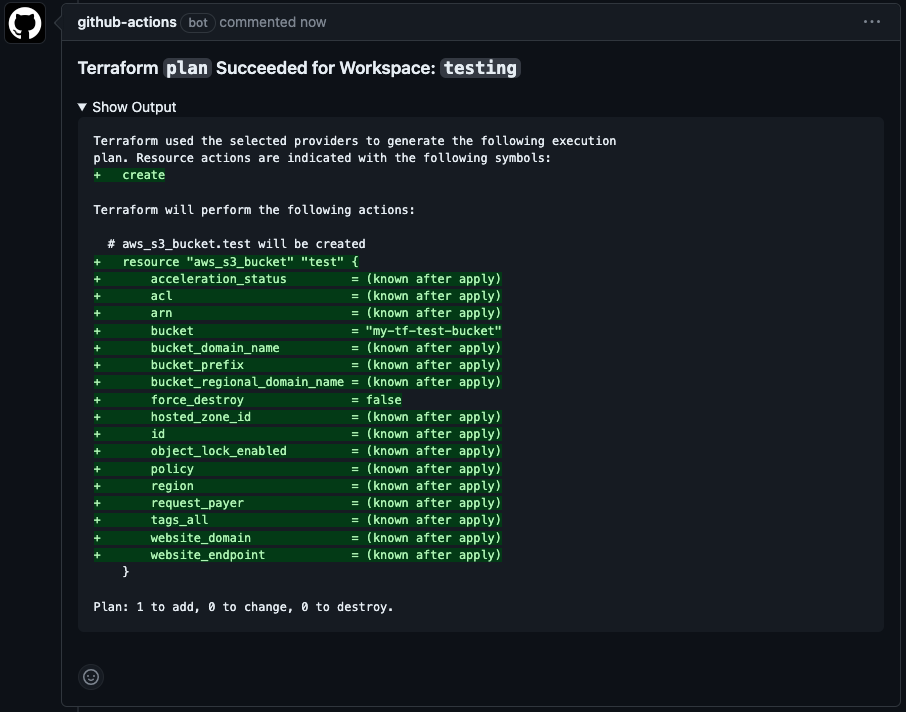
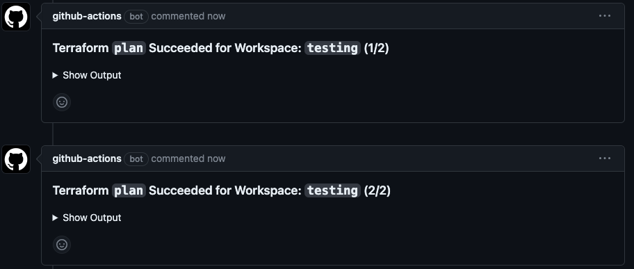
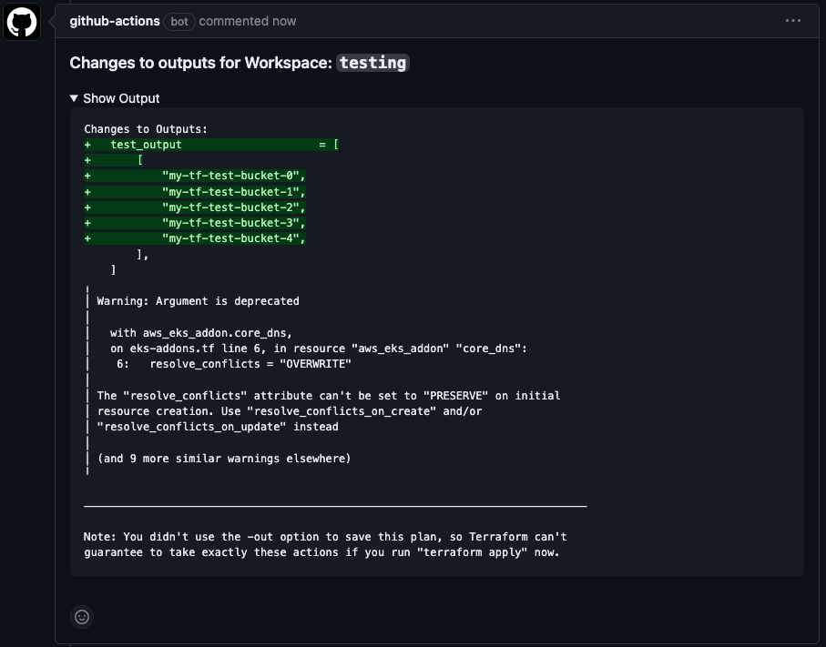
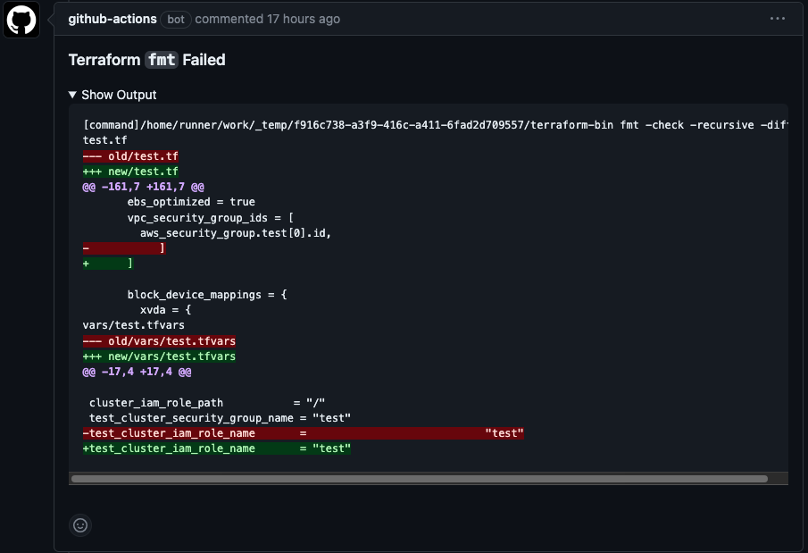
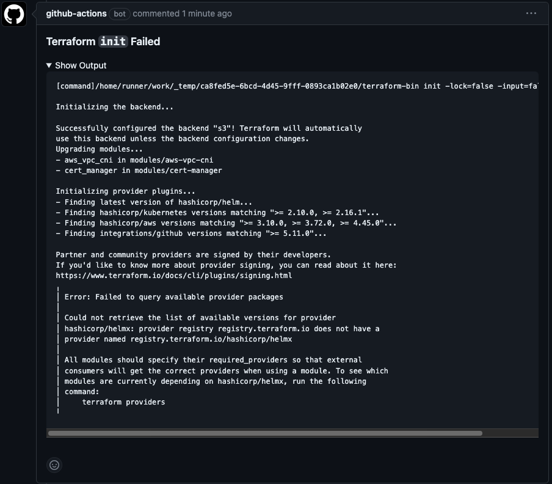
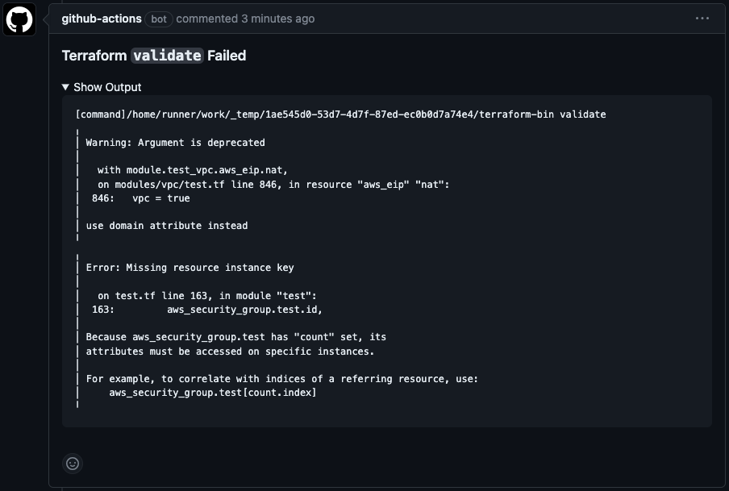
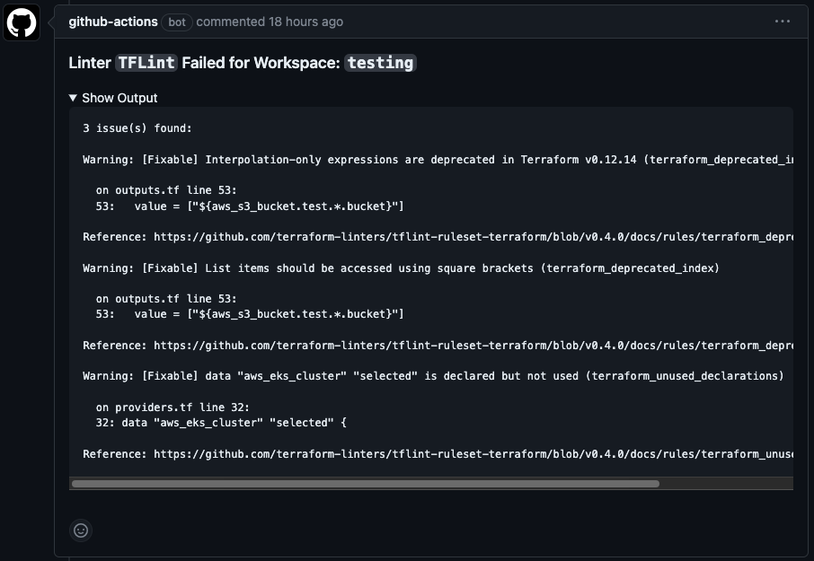

# Terraform PR Commenter

> This project was forked from <https://github.com/robburger/terraform-pr-commenter> project, originally created by [
Rob Burger](https://github.com/robburger).

## Summary

This Docker-based GitHub Action is designed to work in tandem with [hashicorp/setup-terraform](https://github.com/hashicorp/setup-terraform) and [terraform-linters/setup-tflint](https://github.com/terraform-linters/setup-tflint) with the **wrapper enabled**, taking the output from a `fmt`, `init`, `plan`, `validate` or `tflint`, formatting it and adding it to a pull request. Any previous comments from this Action are removed to keep the PR timeline clean.

> The `terraform_wrapper` needs to be set to `true` for the `hashicorp/setup-terraform` step if using `stdout`, `stderr` and the `exitcode` step outputs like the below examples.

> The `tflint_wrapper` needs to be set to `true` for the `terraform-linters/setup-tflint` step if using `stdout`, `stderr` and the `exitcode` step outputs like the below examples.

Support (for now) is [limited to Linux](https://help.github.com/en/actions/creating-actions/about-actions#types-of-actions) as Docker-based GitHub Actions can only be used on Linux runners.

## Usage

This action can only be run after a Terraform `fmt`, `init`, `plan`, `validate` or `tflint` has completed, and the output has been captured. Terraform rarely writes to `stdout` and `stderr` in the same action, so the `commenter_input` needs to be concatenated. For the `plan` commenter type we recommend saving the output to a file instead of using stdout/stderr as this allows us to bypass size limits for variables so large terraform plans don't need to be truncated.

Example Workflow:

```yaml
name: Terraform

on:
  pull_request:

env:
  GITHUB_TOKEN: ${{ secrets.GITHUB_TOKEN }}
  TF_WORKSPACE: "example"
  TF_VERSION: "1.4.6"

jobs:
  terraform:
    name: Run Terraform and Comment
    runs-on: ubuntu-latest
  steps:
    - name: HashiCorp - Setup Terraform
      uses: hashicorp/setup-terraform@v2
      with:
        terraform_version: ${{ env.TF_VERSION }}
    - name: Terraform Format
      id: fmt
      run: |
        terraform fmt -check -recursive -diff
      continue-on-error: true
    - name: Post Format Comment
      if: ${{ always() && (steps.fmt.outcome == 'success' || steps.fmt.outcome == 'failure') }}
      uses: GetTerminus/terraform-pr-commenter@v3
      with:
        commenter_type: fmt
        commenter_input: ${{ format('{0}{1}', steps.fmt.outputs.stdout, steps.fmt.outputs.stderr) }}
        commenter_exitcode: ${{ steps.fmt.outputs.exitcode }}
    - name: Terraform Init
      id: init
      run: terraform init -lock=false -input=false
    - name: Post Init Comment
      if: ${{ always() && (steps.init.outcome == 'success' || steps.init.outcome == 'failure') }}
      uses: GetTerminus/terraform-pr-commenter@v3
      with:
        commenter_type: init
        commenter_input: ${{ format('{0}{1}', steps.init.outputs.stdout, steps.init.outputs.stderr) }}
        commenter_exitcode: ${{ steps.init.outputs.exitcode }}
    - name: Terraform Validate
      id: validate
      run: terraform validate
    - name: Post TF Validate Comment
      if: ${{ always() && (steps.validate.outcome == 'success' || steps.validate.outcome == 'failure') }}
      uses: GetTerminus/terraform-pr-commenter@v3
      with:
        commenter_type: validate
        commenter_input: ${{ format('{0}{1}', steps.validate.outputs.stdout, steps.validate.outputs.stderr) }}
        commenter_exitcode: ${{ steps.validate.outputs.exitcode }}
    - name: TFLint - Setup
      uses: terraform-linters/setup-tflint@v3
      with:
        tflint_wrapper_enabled: true
    - name: TFLint - Run
      id: tflint
      run: |
        tflint --version
        tflint --init
        tflint
    - name: Post TFLint Comment
      if: ${{ always() && (steps.tflint.outcome == 'success' || steps.tflint.outcome == 'failure') }}
      uses: GetTerminus/terraform-pr-commenter@dpr-update-commenter
      with:
        commenter_type: tflint
        commenter_input: ${{ format('{0}{1}', steps.tflint.outputs.stdout, steps.tflint.outputs.stderr) }}
        commenter_exitcode: ${{ steps.tflint.outputs.exitcode }}
    - name: Terraform Plan
      id: plan
      run: terraform plan -lock=false -input=false |& tee tf_plan.txt
    - uses: GetTerminus/terraform-pr-commenter@v3
      env:
        GITHUB_TOKEN: ${{ secrets.GITHUB_TOKEN }}
        TF_WORKSPACE: ${{ inputs.terraform_workspace }}
      with:
        commenter_type: plan
        commenter_plan_path: tf_plan.txt
        commenter_exitcode: ${{ steps.plan.outputs.exit }}
```

### Inputs

| Name                  | Requirement    | Description                                                                                                                                                         |
|-----------------------|----------------|---------------------------------------------------------------------------------------------------------------------------------------------------------------------|
| `commenter_type`      | ___required___ | The type of comment. Options: [`fmt`, `init`, `plan`, `validate`, `tflint`]                                                                                         |
| `commenter_input`     | ___optional___ | The comment to post from a previous step output. For plan commenter type either `commenter_input` or `commenter_plan_path` must be set. _This is limited to 128KiB_ |
| `commenter_plan_path` | ___optional___ | The plan file path including the filename. Only available for plan commenter types.                                                                                 |
| `commenter_exitcode`  | ___required___ | The exit code from a previous step output.                                                                                                                          |
| `terraform_version`   | ___optional___ | The version of terraform from the workflow. Defaults to `1.4.6`.                                                                                                    |
| `use_beta_version`    | ___optional___ | Whether or not to use the beta version of the commenter.                                                                                                            |

### Environment Variables

| Name                     | Requirement    | Description                                                                                                                                               |
|--------------------------|----------------|-----------------------------------------------------------------------------------------------------------------------------------------------------------|
| `GITHUB_TOKEN`           | ___required___ | Used to execute API calls. The `${{ secrets.GITHUB_TOKEN }}` already has permissions, but if you're using your own token, ensure it has the `repo` scope. |
| `TF_WORKSPACE`           | ___optional___ | Default: `default`. This is used to separate multiple comments on a pull request in a matrix run.                                                         |
| `EXPAND_SUMMARY_DETAILS` | ___optional___ | Default: `false`. This controls whether the comment output is collapsed or not.                                                                           |
| `HIGHLIGHT_CHANGES`      | ___optional___ | Default: `true`. This switches `~` to `!` in `plan` diffs to highlight Terraform changes in orange. Set to `false` to disable.                            |
| `COMMENTER_DEBUG`        | ___optional___ | Default: `false`. This switches the commenter into debug mode.                                                                                            |

## Notes

* The commenter requires a pull request to run so the github event must contain a `.pull_request.number`.
* For large terraform plans using stdout/stder, there is aproximately  128KiB limit to the size of the `commenter_input`. If your output is larger than that you will need to either truncate or switch the output to a text file as shown in the workflow example above. An example of how to truncate the plan output is shown below.

Example TF Plan Truncate:

```yaml
- name: TF Plan - Truncate
  id: plan
  # have to use /bin/bash because GHA runs by default with `set -e` to end execution on any error.
  # we want to capture the error instead.
  shell: '/bin/bash {0}'
  run: |
    # copy the stdout file handle to fd5.
    exec 5>&1

    # merge stderr into stdout and print it to fd5 (parent shell's stdout); exit with the code from terraform plan
    OUTPUT=$(terraform plan -lock=false -input=false 2>&1 | tee /dev/fd/5; exit ${PIPESTATUS[0]})

    # store the exit code here
    EXITCODE=$?

    # github actions doesn't allow us to set a multiline output so we export it to the environment
    EOF=$(dd if=/dev/urandom bs=15 count=1 status=none | base64)
    echo "PLAN_OUTPUT<<$EOF" >> $GITHUB_OUTPUT
    echo "${OUTPUT::128000}" >> $GITHUB_OUTPUT
    echo "$EOF" >> $GITHUB_OUTPUT

    # set exit code for pickup later, and make sure we exit with same code
    echo "exitcode=$EXITCODE" >> $GITHUB_OUTPUT
    exit $EXITCODE
```

## Screenshots

### `plan`







### `fmt`



### `init`



### `validate`



### `tflint`



## Troubleshooting & Contributing

Feel free to head over to the [Issues](https://github.com/GetTerminus/terraform-pr-commenter//issues) tab to see if the issue you're having has already been reported. If not, [open a new one](https://github.com/GetTerminus/terraform-pr-commenter/issues/new) and be sure to include as much relevant information as possible, including code-samples, and a description of what you expect to be happening.

## License

[MIT](LICENSE)
